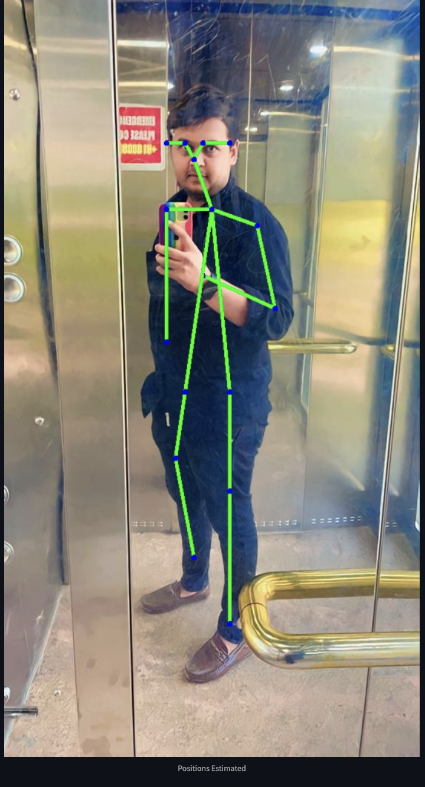
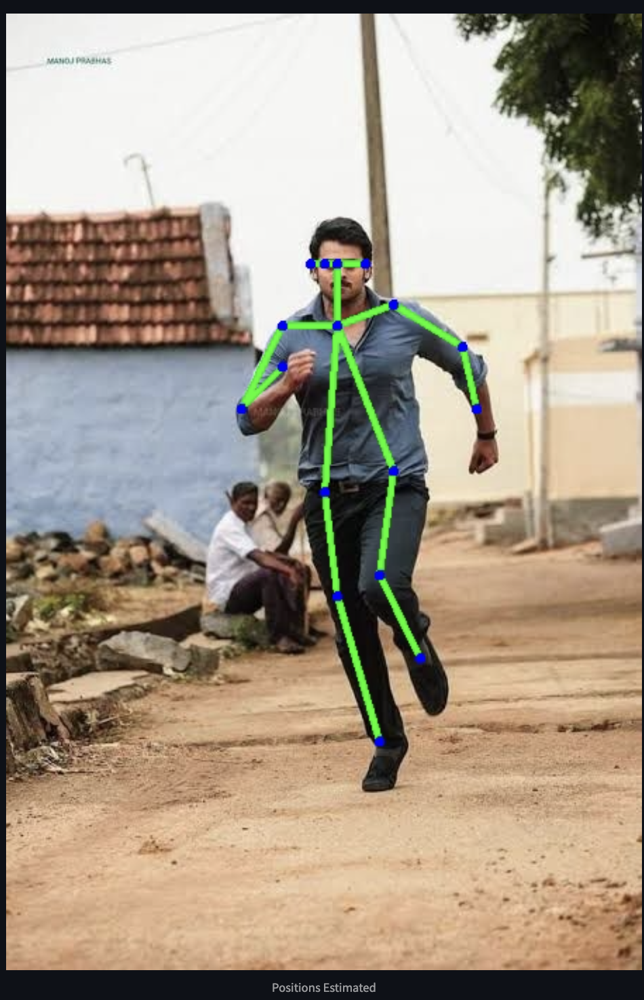
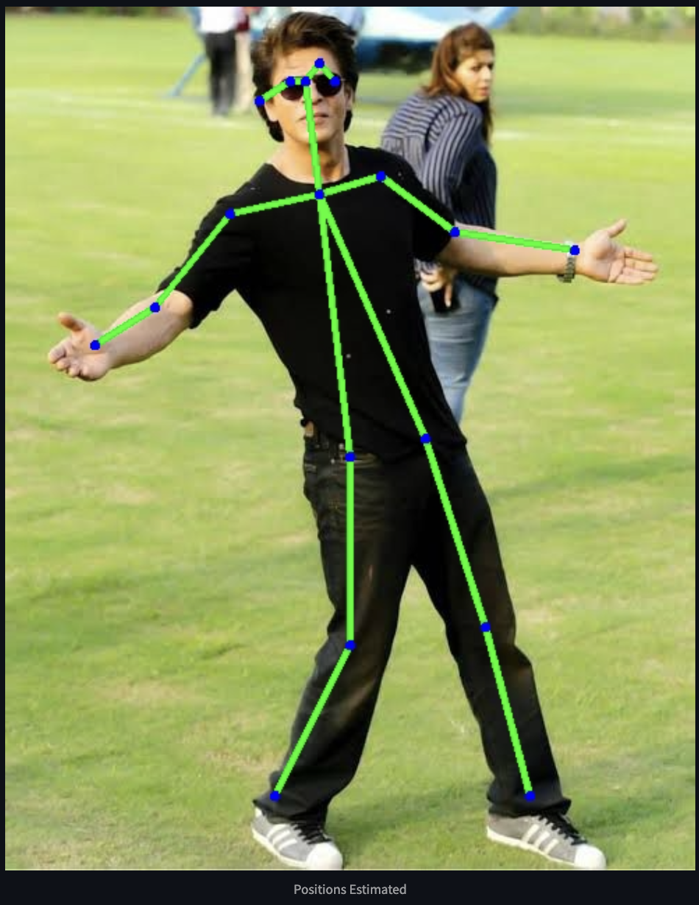
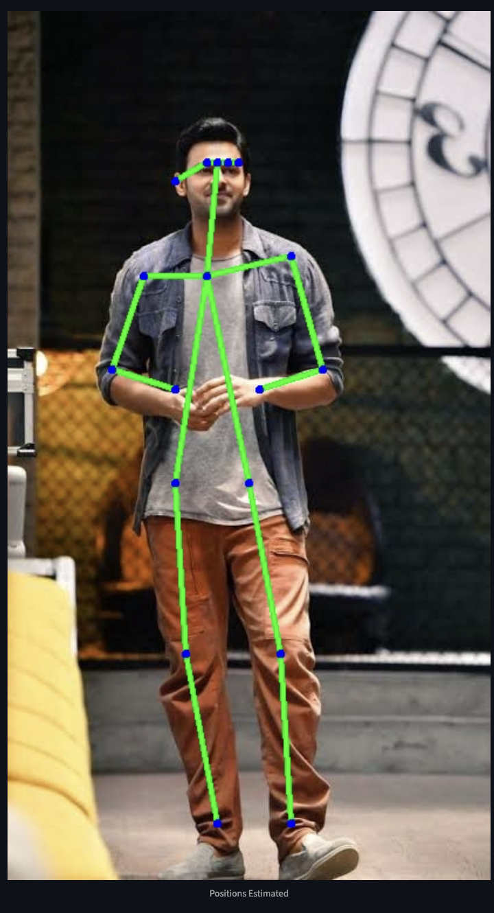

# Leveraging Machine Learning for Human Pose Recognition

This project utilizes machine learning techniques to recognize human poses from two types of datasets: **images** and **videos**. The system detects key points of the human body, enabling pose analysis and activity recognition.

## 📜 Project Overview

Human pose recognition is a critical task in computer vision, with applications ranging from sports analytics to healthcare. This project demonstrates a machine learning-based approach to detect, analyze, and recognize human poses in both static images and dynamic video sequences.

### Features:
- **Image Processing**: Analyze static images for pose estimation.
- **Video Processing**: Detect and track poses in video sequences.
- **Activity Recognition**: Classify actions like standing, running, and sitting.
- **Interactive Interface**: User-friendly Streamlit application for dataset analysis.

---

## 🚀 Getting Started

### Prerequisites
Ensure you have the following installed:
- Python 3.8 or higher
- Virtual environment (optional but recommended)
- Libraries: Streamlit, OpenCV, NumPy, TensorFlow (or PyTorch), and other dependencies listed in `requirements.txt`.

---
#### Requirements (`requirements.txt`)
```plaintext
streamlit==1.25.0
opencv-python==4.7.0
numpy==1.23.5
```

---

### Project Structure
```plaintext
.
├── pose_recognition.py    # Main application script
├── requirements.txt       # Required Python packages
├── README.md              # Project documentation
├── datasets/              # Folder for images/videos
├── outputs/               # Folder for processed results
└── models/                # Pretrained models for pose recognition
```

---

## 🛠 Technologies Used
- **Python**: Programming language
- **OpenCV**: Video and image processing
- **Streamlit**: Interactive web application
- **TensorFlow/PyTorch**: Machine learning framework for pose recognition

---
## 🎥 Outputs
### Images:






---
### Videos:
1. [Output Video 1](Output_/Video_1.mp4)
2. [Output Video 2](Output_/Video_2.mp4)
